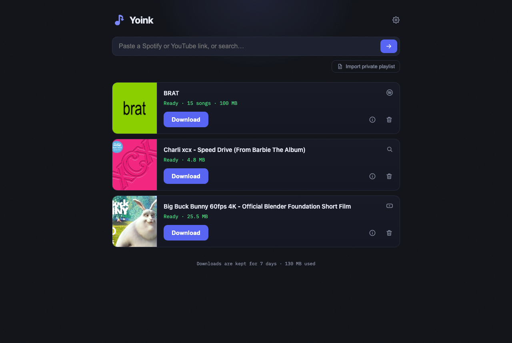

# Yoink

Yoink is a self-hosted web UI for downloading music. Paste a Spotify or
YouTube link, get tagged audio files back — from your phone, your laptop, or
anything else with a browser. It is a **utility, not a music library**: no
accounts to link, no collection to curate. Files wait a week, then clean
themselves up.

Key capabilities:

* **Spotify** tracks, albums, playlists and artists — matched on YouTube
  Music by [spotDL](https://github.com/spotDL/spotify-downloader), tagged
  with real Spotify metadata and cover art. No Spotify account or API keys.
* **YouTube and 1,700+ other sites**, via
  [yt-dlp](https://github.com/yt-dlp/yt-dlp). Free-text search works too.
* **Playlists come out ordered** — `01 - Artist - Title.mp3` plus an
  `.m3u8`, so dumb players (car USB, sports headphones) play them in order.
* **Private playlists and Liked Songs** via CSV import from
  [exportify.net](https://exportify.net); failed tracks are listed with a
  one-click *Retry missing*.



## 🐳 Run using Docker

```bash
docker run -d -p 127.0.0.1:8080:8080 ghcr.io/daireb/yoink
```

That's the whole thing — downloads live inside the container and you fetch
them through the UI. It's the try-it command: replacing the container (which
is how updates work) starts fresh. For an install that keeps its state, use
compose:

## 🐳 Run using Docker Compose

```yaml
services:
  yoink:
    image: ghcr.io/daireb/yoink:latest
    container_name: yoink
    restart: unless-stopped
    user: "10001:10001"
    read_only: true
    cap_drop: [ALL]
    security_opt: [no-new-privileges:true]
    tmpfs: [/tmp]
    ports:
      - "127.0.0.1:8080:8080"
    volumes:
      - yoink-downloads:/downloads
      - yoink-data:/data

volumes:
  yoink-downloads:
  yoink-data:
```

Either way, open **http://localhost:8080** — x86-64 and ARM64 both work, and
nothing needs configuring: downloads live in a Docker volume and you fetch
them through the UI.

For a permanent install, prefer the repo's
[docker-compose.yml](docker-compose.yml) — same thing plus log rotation and
every setting wired to `.env`:

```bash
mkdir yoink && cd yoink
curl -fsSLO https://raw.githubusercontent.com/daireb/yoink/main/docker-compose.yml
docker compose up -d
```

## ⚙️ Configuration

Everything is optional. Set values in `.env` next to the compose file
([.env.example](.env.example) documents each one inline).

| Variable | Default | Purpose |
|---|---|---|
| `YOINK_DOWNLOADS` | *(Docker volume)* | set a host folder to keep files on your machine (must be writable by uid 10001) |
| `YOINK_KEEP_DAYS` | `7` | days a finished download is kept |
| `YOINK_PASSWORD` | *(unset — no login)* | password for the web UI |
| `YOINK_THREADS` | `4` | parallel downloads within one job; use `2` on a small NAS CPU |
| `TUNNEL_TOKEN` | *(unset)* | Cloudflare Tunnel token, if you use the override snippet under *Remote access* |
| `YOINK_UPDATE_CHECK` | `1` | warn in the UI when this install falls behind on yt-dlp |
| `YOINK_PREFLIGHT_TIMEOUT` | `80` | seconds a link lookup may take (keep under your proxy's origin timeout) |
| `YOINK_SECRET` | auto-generated | cookie-signing secret override |

Per-request defaults — 320/192/128 kbps, MP3/M4A/Opus/FLAC, track numbering —
live behind the gear icon in the UI, saved per browser.

## 🌍 Remote access

Yoink has no multi-user model: everyone who reaches it shares one view. The
port binds to `127.0.0.1`, so out of the box nothing else can reach it.

* **Your LAN** — change the port mapping to `"8080:8080"` and set
  `YOINK_PASSWORD` to a long passphrase.
* **From anywhere** — put an identity proxy in front and leave the password
  unset. The simplest is [Tailscale](https://tailscale.com/): `tailscale
  serve 8080` on the host, done. For [Cloudflare
  Tunnel + Access](https://one.dash.cloudflare.com) on your own domain, drop
  this next to the compose file as `docker-compose.override.yml` (compose
  merges it automatically) with your tunnel token in `.env`:

  ```yaml
  services:
    cloudflared:
      image: cloudflare/cloudflared:latest
      restart: unless-stopped
      network_mode: host
      command: tunnel run --token ${TUNNEL_TOKEN}
  ```

  Point the tunnel's public hostname at `http://localhost:8080`, and **add
  the Access policy before sharing the URL** (Zero Trust → Access →
  Applications → your hostname → allow your email) — a tunnel without a
  policy is open to the world.

Yoink trusts `X-Forwarded-Proto` from whatever fronts it, so cookies get the
`Secure` flag automatically over HTTPS.

## 🔄 Updating

yt-dlp is what goes stale — YouTube changes something every few weeks and
old releases stop working. A new Yoink image is published automatically
whenever a new yt-dlp release is available, so keeping fresh is one command,
run on any schedule (weekly is plenty):

```bash
docker compose pull && docker compose up -d
```

The repo's [update.sh](update.sh) does the same plus housekeeping, and skips
the restart while a download is running. A plain `restart` updates nothing —
yt-dlp is baked into the image. If an install falls more than two weeks
behind, the UI shows a banner saying so, with the command to run: during
normal operation you never see it.

Running from source instead: `docker build -t yoink:local .` and set
`YOINK_IMAGE=yoink:local` in `.env`.

## 📝 Notes

* **Audio quality, honestly.** Spotify is only ever the *metadata* source —
  audio comes from YouTube, whose anonymous ceiling is a ~130 kbps Opus/AAC
  stream. The 320 kbps default transcodes that with maximum headroom; it
  sounds good, but it is not a lossless rip. That trade is what keeps the
  tool free of account logins and ban risk. For bit-perfect copies, buy the
  files.
* **Legal.** A personal tool for music you already have access to — offline
  listening, a USB stick for the car. Downloading from these services may
  conflict with their terms, and redistributing what you download is
  copyright infringement in most places. What you do with it is on you.
* **Interrupted jobs** survive restarts in the SQLite queue and are marked
  `interrupted`; re-submit to continue. Songs a playlist couldn't match are
  listed with a *Retry missing* button that fetches only those.
* **Two lanes.** Single songs, videos and searches run in their own lane, so
  a pasted track never waits behind a 200-item playlist.

## 🧠 How it works

A FastAPI backend and two worker threads shelling out to spotDL and yt-dlp,
in one small hardened image (non-root, read-only filesystem, no
capabilities). Design, engine quirks and the security model are in
**[ARCHITECTURE.md](ARCHITECTURE.md)**.

```
app/main.py                  backend + workers (single file)
app/static/index.html        UI (single file, no build step)
app/spotdl_patch.py          metadata-lookup cache for spotDL
.github/workflows/image.yml  builds, tests and publishes the image
update.sh                    pull the newest image (run on the host)
```

## 🙏 Credits

The heavy lifting is done by
[spotDL](https://github.com/spotDL/spotify-downloader) and
[yt-dlp](https://github.com/yt-dlp/yt-dlp); Yoink is a web UI, a job queue
and some sharp edges filed off. Built with assistance from Claude. MIT
licensed.
